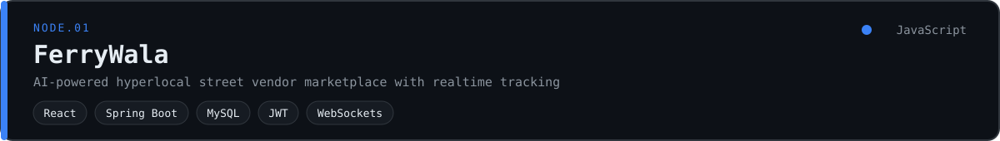
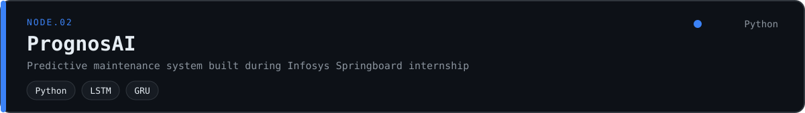
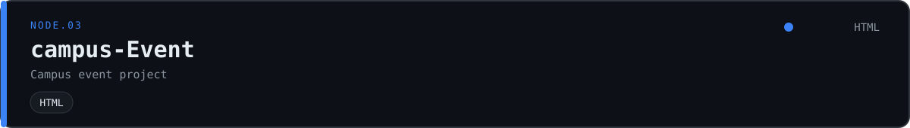

<picture>
  <source media="(prefers-color-scheme: dark) and (max-width: 640px)" srcset="./mobile-dark.svg">
  <source media="(prefers-color-scheme: light) and (max-width: 640px)" srcset="./mobile-light.svg">
  <source media="(prefers-color-scheme: dark)" srcset="./dark.svg">
  <source media="(prefers-color-scheme: light)" srcset="./light.svg">
  
</picture>

### 02 · SYSTEM.INFO

name    Manish Kumar
role    Java Full Stack Developer
edu     B.Tech Computer Science, 2023–2027
        Vel Tech Rangarajan Dr. Sagunthala
        R&D Institute of Science and Technology
intern  AI/ML Developer Intern
        Infosys Springboard
focus   Scalable web applications
        DSA · System design

### 03 · ENGINEERING.STACK

**LANGUAGES** &nbsp; `Java` `Python` `JavaScript` `C` `SQL`

**FRONTEND** &nbsp; `React` `HTML` `CSS`

**BACKEND** &nbsp; `Spring Boot` `Node.js` `Express`

**DATABASE** &nbsp; `MySQL` `PostgreSQL`

**ENGINEERING** &nbsp; `Git` `GitHub` `Linux` `REST APIs` `WebSockets`

### 04 · PROJECT.NODES

<a href="https://github.com/manishyadav73/FerryWala">
  <picture>
    <source media="(prefers-color-scheme: dark)" srcset="./assets/node-ferrywala-dark.svg">
    <source media="(prefers-color-scheme: light)" srcset="./assets/node-ferrywala-light.svg">
    
  </picture>
</a>

<a href="https://github.com/manishyadav73/PrognosAi_Infosys-SpringBoard">
  <picture>
    <source media="(prefers-color-scheme: dark)" srcset="./assets/node-prognosai-dark.svg">
    <source media="(prefers-color-scheme: light)" srcset="./assets/node-prognosai-light.svg">
    
  </picture>
</a>

<a href="https://github.com/manishyadav73/campus-Event">
  <picture>
    <source media="(prefers-color-scheme: dark)" srcset="./assets/node-campus-event-dark.svg">
    <source media="(prefers-color-scheme: light)" srcset="./assets/node-campus-event-light.svg">
    
  </picture>
</a>

### 05 · BUILD.LOG

# pinned repositories · primary language
FerryWala                      JavaScript
PrognosAi_Infosys-SpringBoard  Python
campus-Event                   HTML

<picture>
  <source media="(prefers-color-scheme: dark)" srcset="./assets/feed-dark.svg">
  <source media="(prefers-color-scheme: light)" srcset="./assets/feed-light.svg">
  
</picture>
###05.1 · GITHUB.SKYLINE

  

### 06 · CONNECT

[github.com/manishyadav73](https://github.com/manishyadav73) · open an issue on any repository to start a conversation.
